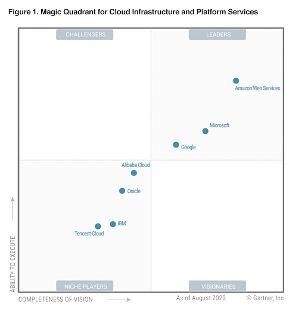
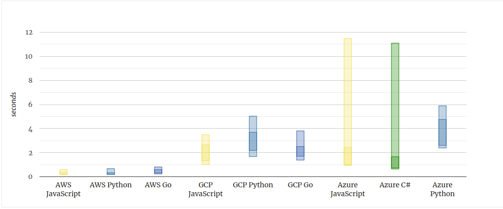
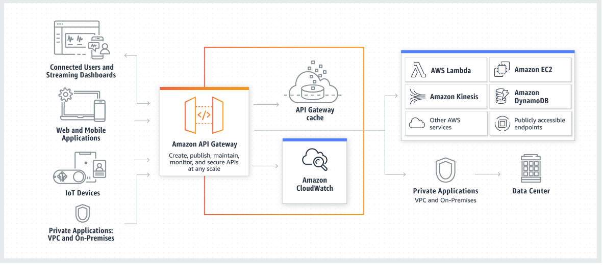

# Выбор темы

У меня появилась потребность в поиске съема новой квартиры. Я начал искать выгодоное мне предложение на интернет платформах,
таких как [Onliner.by[1]](onliner.by), [Realt,by[2]](Realt,by), [Domovita.by[3]](Domovita.by), но столкнулся с проблемой:
каждый раз, когда ты открыаешь сайт в поиске новых объявлений, тебе приходить скурпулезно перебирать все старые, чтобы среди них выявить новое обхявление. Это достаточно хлопотное дельце. Позже, я нашел Flatty (https://t.me/FlattyBy), telegram-bot, который пресылает только новые объявления с платформ по аренде недвижимости. Но там есть больой минус: нет возможности задать фильтры, для получения только тех объявлений, которые подходят под твои критерии поиска. Поэтому и возикла идея реализовать в текущем КП телеграм-бот (помощнк в сфере аренды недвижимости), который бы мог приылать только те новые объяаления, которые будут подходить под Ваши критерии поиска.

# Выбор провайдера/архитектуры/необходимых сервисов

## Выбор провайдера?

В качестве реализации бэкенда, меня давно была интересна [Serverless[10]](https://www.serverless.com/) (микросервисная архитектуры??), поэтому я сразу решил реализовывать своий бэкенд с таким подходом. [Serverless[10]](https://www.serverless.com/) подзразумевает использовать облачные вычесления, поэтому после определения, что я буду реализовывать [Serverless[10]](https://www.serverless.com/) архитектуру, стал вопрос выбора облачного провайдера.

Текущие популрные облачные провайдеры: AWS (Amazon Web Services), MS Azure, Google Cloud Platform, Яндекс.Облако

**Выбор пал на изучение AW**S, тк он самый ТОП среди всех, имееет более 174 сервисов, и покрывает более чем 85% рынка и выгоднее выше перечисленных

Пару статей почему:

- [тут есть график, AWS круче всех](https://www.datamation.com/cloud-computing/aws-vs-azure-vs-google-cloud-comparison.html)
- [тут графики, которые относятся к AWS Lambda (реализация Serveless на AWS)](https://mikhail.io/serverless/coldstarts/aws/)
- [тут графики и сравнение реализации Serverless на разных провайдерах (AWS Lambda, GCP functions, Azure)](https://mikhail.io/serverless/coldstarts/big3/)



## имплементация архитектуры?

Мы определились с облачным провадером: AWS;
следующим шагом нам надо продумать микросервисную архитектуру, какие сервисы нам необходимы, и как их использовать/связать.

- AWS Lambda
- AWS APIGateway
- AWS DynamoDB
- AWS CloudWatch
  - AWS Cognito
  - AWS S3
  - AWS AppSync
  - AWS VTL
  - AWS CloudFormation
  - AWS System Manager
  - AWS KMS
  - AWS Amplify
  - AWS SNS

### **1. AWS Lambda**

Сразу ясно, что основная бизнес логика будет исполнятся Serverless с помощью [AWS Lambda [18]](https://docs.aws.amazon.com/lambda/index.html). Почему [AWS Lambda [18]](https://docs.aws.amazon.com/lambda/index.html)? .[ВСЕ ОТВЕТЫ ТУТ](https://aws.amazon.com/ru/lambda/features/). **[AWS Lambda [18]](https://docs.aws.amazon.com/lambda/index.html)** позволяет запускать программный код без выделения серверов и управления ими. Вы платите только за фактическое время вычисления. Если программный код не исполняется, оплата не требуется. С помощью Lambda можно запускать практически любые виды приложений и серверных сервисов, при этом не требуются какие-либо операции администрирования. Просто загрузите программный код, и Lambda обеспечит все ресурсы, необходимые для его исполнения, масштабирования и обеспечения высокой доступности. Можно настроить автоматический запуск программного кода из других сервисов AWS или вызывать его непосредственно из любого мобильного или интернет‑приложения.

**Вопрос: Что такое бессерверные вычисления?**

Бессерверные вычисления позволяют создавать и запускать приложения и сервисы, не беспокоясь о серверах. При бессерверных вычислениях приложение по‑прежнему работает на серверах, но управление этими серверами AWS полностью берет на себя. В основе бессерверных вычислений лежит сервис AWS Lambda, позволяющий запускать код без выделения серверов или управления ими.

> ПАРУ УМНЫХ ГРАФИКОВ

- [тут графики, которые относятся к AWS Lambda (реализация Serveless на AWS)](https://mikhail.io/serverless/coldstarts/aws/)
- [тут графики и сравнение реализации Serverless на разных провайдерах (AWS Lambda, GCP functions, Azure)](https://mikhail.io/serverless/coldstarts/big3/)



> **сравнение Cold Start разных облачных провайдеров с разными языками**

> **Что такое холодный старт?** ❄️ При запуске бессерверной функции она будет оставаться активной (иначе говоря, горячей), пока вы ее запускаете. Ваш контейнер остается живым, готовым к исполнению. После периода бездействия ваш облачный провайдер сбросит контейнер, и ваша функция станет неактивной (иначе говоря, холодной). Холодный запуск происходит, когда вы выполняете неактивную функцию. Задержка возникает из-за того, что ваш облачный провайдер подготовит выбранный вами контейнер среды выполнения, а затем запустит вашу функцию.Короче говоря, этот процесс значительно увеличит время выполнения.

### **2. AWS APIGateway**

нужно для реализации https endpoint-ов. С помощью его легко сделать REST или тп

[AWS API Gateway[21]](https://docs.aws.amazon.com/apigateway/index.html) – это полностью управляемый сервис для разработчиков, предназначенный для создания, публикации, обслуживания, мониторинга и обеспечения безопасности API в любых масштабах. Через API приложения получают доступ к данным, бизнес‑логике или функциональным возможностям ваших серверных сервисов. API Gateway позволяет создавать API RESTful и WebSocket, которые являются главным компонентом приложений для двусторонней связи в режиме реального времени. [AWS API Gateway[21]](https://docs.aws.amazon.com/apigateway/index.html) поддерживает рабочие нагрузки в контейнерах и бессерверные рабочие нагрузки, а также интернет‑приложения.

[AWS API Gateway[21]](https://docs.aws.amazon.com/apigateway/index.html) берет на себя все задачи, связанные с приемом и обработкой сотен тысяч одновременных вызовов API, включая управление трафиком, поддержку CORS, авторизацию и контроль доступа, регулирование количества запросов, мониторинг и управление версиями API. Работа с API Gateway не требует минимальных платежей или стартовых вложений. Вы платите за полученные вызовы API и переданный объем данных и можете с помощью многоуровневой модели ценообразования API Gateway снизить свои расходы по мере масштабирования использования API.

### **Принцип работы API Gateway**



> В контекстке моего приложения, используется для того, чтобы сделать HTTP Endpoint (webhook для telegram-bot-а), который будет являтся тригером для вызова [Lambad функции (ссылка на функцию)](../src/telegram-bot/webhook.ts)

### **3. AWS DynamoDB**

[AWS DynamoDB[17]](https://docs.aws.amazon.com/dynamodb/index.html) – это база данных пар «ключ‑значение» и документов, которая обеспечивает задержку менее 10 миллисекунд при работе в любом масштабе. Это надежная полностью управляемая база данных для приложений в масштабе всего Интернета, которая работает в нескольких регионах с несколькими ведущими серверами и обладает встроенными средствами обеспечения безопасности, резервного копирования и восстановления, а также кэширования в памяти. DynamoDB может обрабатывать более 10 трлн запросов в день и справляться с пиковыми нагрузками, превышающими 20 млн запросов в секунду.

Многие из наиболее активно развивающихся компаний в мире, например Lyft, Airbnb и Redfin, а также крупные корпорации, такие как Samsung, Toyota и Capital One, используют масштабируемый и высокопроизводительный сервис DynamoDB для выполнения критически важных рабочих нагрузок.

[AWS DynamoDB[17]](https://docs.aws.amazon.com/dynamodb/index.html) - это полностью управляемая служба базы данных NoSQL, которая обеспечивает быструю и предсказуемую производительность с бесшовной масштабируемостью. Если вы разработчик, вы можете использовать Amazon DynamoDB для создания таблицы базы данных, которая может хранить и извлекать любой объем данных и обслуживать любой уровень трафика запросов. Amazon DynamoDB автоматически распределяет данные и трафик для таблицы по достаточному количеству серверов, чтобы обрабатывать объем запросов, указанный клиентом, и объем хранимых данных, сохраняя при этом стабильную и высокую производительность. Все элементы данных хранятся на твердотельных дисках (SSD).

> тут следует наверное вставить, я коллекции `OnlinerApartment` я использовал `TTl Attribute` для эффективного удаления объявлений из колекции. Это удаление производится автоматически и не снижает пропускную. способность бд и эти вызовы бесплатны, в отличие от тех, когда мы будем вручную выполнять `Delete` операции. **Ниже будет приведено описание `aws_dynamodb_table` ресурса с определнием ttl атрибитом**. [Место в коде](../terraform/modules/tables/tables.tf)

```tf
resource "aws_dynamodb_table" "OnlinerApartment" {
  name     = "OnlinerApartment"
  hash_key = "id"

  attribute {
    name = "id"
    type = "N"
  }

  ttl {
    attribute_name = "expirationTime"
    enabled        = true
  }

  billing_mode = "PAY_PER_REQUEST"

  lifecycle {
    prevent_destroy = true
  }

  point_in_time_recovery {
    enabled = true
  }
}
```

**TTl Attribute** позволяет определить метку времени для каждого элемента, чтобы определить, когда элемент больше не нужен. Вскоре после даты и времени указанной метки времени DynamoDB удаляет элемент из таблицы, не снижая пропускной способности записи. TTL предоставляется без дополнительных затрат как средство уменьшения объемов хранимых данных за счет сохранения только тех элементов, которые остаются актуальными для потребностей вашей рабочей нагрузки.

TTL полезно, если вы храните элементы, которые теряют актуальность через определенное время. Ниже приведены примеры использования TTL:

- Удалите данные пользователя или датчика после одного года бездействия в приложении.
- Архивируйте просроченные элементы в озеро данных Amazon S3 через DynamoDB Streams и AWS Lambda.
- Храните конфиденциальные данные в течение определенного времени в соответствии с договорными или нормативными обязательствами.

### **4. AWS CloudWatch**

S

## Ссылки

1. [Onliner.by](Onliner.by)
2. [Realt.by](https://realt.by/)
3. [Domovita.by](https://domovita.by/)
4. [TypeScript](https://www.typescriptlang.org/docs/handbook/utility-types.html)
5. [ESLint](https://eslint.org/docs/user-guide/configuring)
6. [TSLint](https://palantir.github.io/tslint/)
7. [Prettier](https://prettier.io/docs/en/options.html)
8. [Webpack](https://webpack.js.org/)
9. [Yarn](https://classic.yarnpkg.com/en/docs/)
10. [Serverless](https://www.serverless.com/)
11. [Terraform](https://www.terraform.io/)
12. [Vercel](https://vercel.com/docs)
13. [AWS-Vault](https://github.com/99designs/aws-vault)
14. [Github](https://github.com/)
15. [AWS Cognito](https://docs.aws.amazon.com/cognito/)
16. [AWS S3](https://docs.aws.amazon.com/s3/index.html)
17. [AWS DynamoDB](https://docs.aws.amazon.com/dynamodb/index.html)
18. [AWS Lambda](https://docs.aws.amazon.com/lambda/index.html)
19. [AWS AppSync](https://docs.aws.amazon.com/appsync/latest/devguide/welcome.html)
20. [AWS VTL](https://docs.aws.amazon.com/appsync/latest/devguide/resolver-context-reference.html)
21. [AWS APIGateway](https://docs.aws.amazon.com/apigateway/index.html)
22. [AWS CloudFormation](https://docs.aws.amazon.com/cloudformation/)
23. [AWS System Manager](https://docs.aws.amazon.com/systems-manager/index.html)
24. [AWS KMS](https://aws.amazon.com/kms/)
25. [AWS CloudWatch](https://docs.aws.amazon.com/cloudwatch/index.html)
26. [AWS Amplify](https://docs.amplify.aws/)
27. [AWS SNS](https://docs.aws.amazon.com/sns/index.html)
28. [Angular](https://angular.io/)
29. [Telegam API](https://core.telegram.org/)
