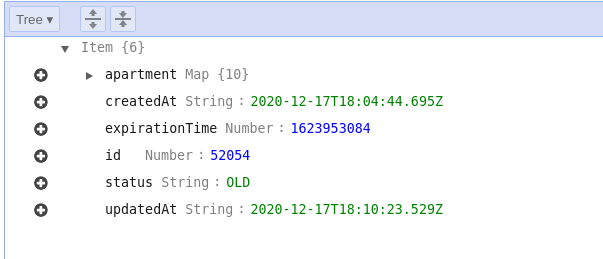

# **Выбор темы**

У меня появилась потребность в поиске съема новой квартиры. Я начал искать выгодоное мне предложение на интернет платформах,
таких как [Onliner.by[1]](onliner.by), [Realt,by[2]](Realt,by), [Domovita.by[3]](Domovita.by), но столкнулся с проблемой:
каждый раз, когда ты открыаешь сайт в поиске новых объявлений, тебе приходить скурпулезно перебирать все старые, чтобы среди них выявить новое обхявление. Это достаточно хлопотное дельце. Позже, я нашел Flatty (https://t.me/FlattyBy), telegram-bot, который пресылает только новые объявления с платформ по аренде недвижимости. Но там есть больой минус: нет возможности задать фильтры, для получения только тех объявлений, которые подходят под твои критерии поиска. Поэтому и возикла идея реализовать в текущем КП телеграм-бот (помощнк в сфере аренды недвижимости), который бы мог приылать только те новые объяаления, которые будут подходить под Ваши критерии поиска.

# **Выбор провайдера/архитектуры/необходимых сервисов**

## Выбор провайдера?

В качестве реализации бэкенда, меня давно была интересна [Serverless[10]](https://www.serverless.com/) (микросервисная архитектуры??), поэтому я сразу решил реализовывать своий бэкенд с таким подходом. [Serverless[10]](https://www.serverless.com/) подзразумевает использовать облачные вычесления, поэтому после определения, что я буду реализовывать [Serverless[10]](https://www.serverless.com/) архитектуру, стал вопрос выбора облачного провайдера.

Текущие популрные облачные провайдеры: AWS (Amazon Web Services), MS Azure, Google Cloud Platform, Яндекс.Облако

**Выбор пал на изучение AW**S, тк он самый ТОП среди всех, имееет более 174 сервисов, и покрывает более чем 85% рынка и выгоднее выше перечисленных

Пару статей почему:

- [тут есть график, AWS круче всех](https://www.datamation.com/cloud-computing/aws-vs-azure-vs-google-cloud-comparison.html)
- [тут графики, которые относятся к AWS Lambda (реализация Serveless на AWS)](https://mikhail.io/serverless/coldstarts/aws/)
- [тут графики и сравнение реализации Serverless на разных провайдерах (AWS Lambda, GCP functions, Azure)](https://mikhail.io/serverless/coldstarts/big3/)


## разработка/имплементация архитектуры?

Мы определились с облачным провадером: AWS;
следующим шагом нам надо продумать микросервисную архитектуру, какие сервисы нам необходимы, и как их использовать/связать.

- AWS Lambda
- AWS APIGateway
- AWS DynamoDB
- AWS CloudWatch
- AWS System Manager
- AWS CloudFormation
- AWS S3
- AWS Cognito
- AWS AppSync
  - AWS VTL
- AWS Amplify (не описал)
- AWS SNS (не описал)

### **1. AWS Lambda**

Сразу ясно, что основная бизнес логика будет исполнятся Serverless с помощью [AWS Lambda [18]](https://docs.aws.amazon.com/lambda/index.html). Почему [AWS Lambda [18]](https://docs.aws.amazon.com/lambda/index.html)? .[ВСЕ ОТВЕТЫ ТУТ](https://aws.amazon.com/ru/lambda/features/). **[AWS Lambda [18]](https://docs.aws.amazon.com/lambda/index.html)** позволяет запускать программный код без выделения серверов и управления ими. Вы платите только за фактическое время вычисления. Если программный код не исполняется, оплата не требуется. С помощью Lambda можно запускать практически любые виды приложений и серверных сервисов, при этом не требуются какие-либо операции администрирования. Просто загрузите программный код, и Lambda обеспечит все ресурсы, необходимые для его исполнения, масштабирования и обеспечения высокой доступности. Можно настроить автоматический запуск программного кода из других сервисов AWS или вызывать его непосредственно из любого мобильного или интернет‑приложения.

**Вопрос: Что такое бессерверные вычисления?**

Бессерверные вычисления позволяют создавать и запускать приложения и сервисы, не беспокоясь о серверах. При бессерверных вычислениях приложение по‑прежнему работает на серверах, но управление этими серверами AWS полностью берет на себя. В основе бессерверных вычислений лежит сервис AWS Lambda, позволяющий запускать код без выделения серверов или управления ими.

> ПАРУ УМНЫХ ГРАФИКОВ

- [тут графики, которые относятся к AWS Lambda (реализация Serveless на AWS)](https://mikhail.io/serverless/coldstarts/aws/)
- [тут графики и сравнение реализации Serverless на разных провайдерах (AWS Lambda, GCP functions, Azure)](https://mikhail.io/serverless/coldstarts/big3/)


> **сравнение Cold Start разных облачных провайдеров с разными языками**

---

> **Что такое холодный старт?** ❄️ При запуске бессерверной функции она будет оставаться активной (иначе говоря, горячей), пока вы ее запускаете. Ваш контейнер остается живым, готовым к исполнению. После периода бездействия ваш облачный провайдер сбросит контейнер, и ваша функция станет неактивной (иначе говоря, холодной). Холодный запуск происходит, когда вы выполняете неактивную функцию. Задержка возникает из-за того, что ваш облачный провайдер подготовит выбранный вами контейнер среды выполнения, а затем запустит вашу функцию.Короче говоря, этот процесс значительно увеличит время выполнения.

### **2. AWS APIGateway**

нужно для реализации https endpoint-ов. С помощью его легко сделать REST или тп

[AWS API Gateway[21]](https://docs.aws.amazon.com/apigateway/index.html) – это полностью управляемый сервис для разработчиков, предназначенный для создания, публикации, обслуживания, мониторинга и обеспечения безопасности API в любых масштабах. Через API приложения получают доступ к данным, бизнес‑логике или функциональным возможностям ваших серверных сервисов. API Gateway позволяет создавать API RESTful и WebSocket, которые являются главным компонентом приложений для двусторонней связи в режиме реального времени. [AWS API Gateway[21]](https://docs.aws.amazon.com/apigateway/index.html) поддерживает рабочие нагрузки в контейнерах и бессерверные рабочие нагрузки, а также интернет‑приложения.

[AWS API Gateway[21]](https://docs.aws.amazon.com/apigateway/index.html) берет на себя все задачи, связанные с приемом и обработкой сотен тысяч одновременных вызовов API, включая управление трафиком, поддержку CORS, авторизацию и контроль доступа, регулирование количества запросов, мониторинг и управление версиями API. Работа с API Gateway не требует минимальных платежей или стартовых вложений. Вы платите за полученные вызовы API и переданный объем данных и можете с помощью многоуровневой модели ценообразования API Gateway снизить свои расходы по мере масштабирования использования API.

### **Принцип работы API Gateway**


> В контекстке моего приложения, используется для того, чтобы сделать HTTP Endpoint (webhook для telegram-bot-а), который будет являтся тригером для вызова [Lambad функции (ссылка на функцию)](../src/telegram-bot/webhook.ts)

### **3. AWS DynamoDB**

[AWS DynamoDB[17]](https://docs.aws.amazon.com/dynamodb/index.html) – это база данных пар «ключ‑значение» и документов, которая обеспечивает задержку менее 10 миллисекунд при работе в любом масштабе. Это надежная полностью управляемая база данных для приложений в масштабе всего Интернета, которая работает в нескольких регионах с несколькими ведущими серверами и обладает встроенными средствами обеспечения безопасности, резервного копирования и восстановления, а также кэширования в памяти. DynamoDB может обрабатывать более 10 трлн запросов в день и справляться с пиковыми нагрузками, превышающими 20 млн запросов в секунду.

Многие из наиболее активно развивающихся компаний в мире, например Lyft, Airbnb и Redfin, а также крупные корпорации, такие как Samsung, Toyota и Capital One, используют масштабируемый и высокопроизводительный сервис DynamoDB для выполнения критически важных рабочих нагрузок.

[AWS DynamoDB[17]](https://docs.aws.amazon.com/dynamodb/index.html) - это полностью управляемая служба базы данных NoSQL, которая обеспечивает быструю и предсказуемую производительность с бесшовной масштабируемостью. Если вы разработчик, вы можете использовать Amazon DynamoDB для создания таблицы базы данных, которая может хранить и извлекать любой объем данных и обслуживать любой уровень трафика запросов. Amazon DynamoDB автоматически распределяет данные и трафик для таблицы по достаточному количеству серверов, чтобы обрабатывать объем запросов, указанный клиентом, и объем хранимых данных, сохраняя при этом стабильную и высокую производительность. Все элементы данных хранятся на твердотельных дисках (SSD).

> тут следует наверное вставить, я коллекции `OnlinerApartment` я использовал `TTl Attribute` для эффективного удаления объявлений из колекции. Это удаление производится автоматически и не снижает пропускную. способность бд и эти вызовы бесплатны, в отличие от тех, когда мы будем вручную выполнять `Delete` операции. **Ниже будет приведено описание `aws_dynamodb_table` которое задает `OnlinerApartment` коллекцию с определнием ttl атрибитом**. [Место в коде](../terraform/modules/tables/tables.tf)

```tf
resource "aws_dynamodb_table" "OnlinerApartment" {
  name     = "OnlinerApartment"
  hash_key = "id"

  attribute {
    name = "id"
    type = "N"
  }

  ttl {
    attribute_name = "expirationTime"
    enabled        = true
  }

  billing_mode = "PAY_PER_REQUEST"

  lifecycle {
    prevent_destroy = true
  }

  point_in_time_recovery {
    enabled = true
  }
}
```

**TTl Attribute** позволяет определить метку времени для каждого элемента, чтобы определить, когда элемент больше не нужен. Вскоре после даты и времени указанной метки времени DynamoDB удаляет элемент из таблицы, не снижая пропускной способности записи. TTL предоставляется без дополнительных затрат как средство уменьшения объемов хранимых данных за счет сохранения только тех элементов, которые остаются актуальными для потребностей вашей рабочей нагрузки.

TTL полезно, если вы храните элементы, которые теряют актуальность через определенное время. Ниже приведены примеры использования TTL:

- Удалите данные пользователя или датчика после одного года бездействия в приложении.
- Архивируйте просроченные элементы в озеро данных Amazon S3 через DynamoDB Streams и AWS Lambda.
- Храните конфиденциальные данные в течение определенного времени в соответствии с договорными или нормативными обязательствами.

### **4. AWS CloudWatch**

[AWS CloudWatch[25]](https://docs.aws.amazon.com/cloudwatch/index.html) - это сервис мониторинга и управления, который предоставляет данные и полезную аналитическую информацию для AWS, гибридных и локальных приложений и ресурсов инфраструктуры. С CloudWatch вы можете собирать и получать доступ ко всем своим производственным и рабочим данным в форме журналов и метрик с единой платформы. Это позволяет преодолеть проблему мониторинга отдельных систем и приложений в разрозненных хранилищах (сервер, сеть, база данных и т. Д.). CloudWatch позволяет отслеживать весь стек (приложения, инфраструктуру и службы) и использовать данные аварийных сигналов, журналов и событий для выполнения автоматических действий и сокращения среднего времени до разрешения (MTTR). Это высвобождает важные ресурсы и позволяет сосредоточиться на создании приложений и создании ценности для бизнеса.

[AWS CloudWatch[25]](https://docs.aws.amazon.com/cloudwatch/index.html) дает вам полезную информацию, которая поможет вам оптимизировать производительность приложений, управлять использованием ресурсов и понять работоспособность системы. CloudWatch обеспечивает видимость данных метрик и журналов до 1 секунды, хранение данных (метрики) в течение 15 месяцев и возможность выполнять вычисления по метрикам. Это позволяет выполнять исторический анализ для оптимизации затрат и получать в реальном времени аналитические данные по оптимизации приложений и ресурсов инфраструктуры.

> пример как это выглядит


> ниже кусок кода [отсюда](../serverless/globals.yml), для подключения `alarms` к моим Lambda функциям

```yml
# custom:
alerts:
  stages: # select which stages to deploy alarms to
    - prod
    - dev
  dashboards: true
  topics:
    alarm:
      topic: lambda-alarms-${opt:stage}-${self:service}
      notifications:
        - protocol: email
          endpoint: alexfomin2402@gmail.com
  alarms:
    - functionThrottles
    - functionErrors
```

> ниже кусок кода [отсюда](../terraform/modules/dynamodb_throttle_alarm/alarm.tf), для подключения `alarms` к моим таблицам [тут](../terraform/modules/alarms/dynamodb.tf)

```tf
variable "tables" {
  type = "list"
}

variable "alarm_action_arn" {}

resource "aws_cloudwatch_metric_alarm" "dynamodb_throttle_monitor" {
  count               = "${length(var.tables)}"
  alarm_name          = "dynamodb-throttled-${element(var.tables, count.index)}"
  comparison_operator = "GreaterThanThreshold"
  evaluation_periods  = "1"
  metric_name         = "ThrottledRequests"
  namespace           = "AWS/DynamoDB"

  dimensions = {
    TableName = "${element(var.tables, count.index)}"
  }

  period                    = "60"
  statistic                 = "Sum"
  unit                      = "Count"
  threshold                 = "0"
  alarm_description         = "Alarm when requests to ${element(var.tables, count.index)} are throttled"
  insufficient_data_actions = []
  alarm_actions             = ["${var.alarm_action_arn}"]
}

```

### **5. AWS System Manager**

> в этом сервисе я юзаю только `Parameter store` !

[AWS System Manager[23]](https://docs.aws.amazon.com/systems-manager/index.html) `Parameter Store` обеспечивает безопасное иерархическое хранилище для управления данными конфигурации и секретами. Вы можете хранить такие данные, как пароли, строки базы данных, идентификаторы образов Amazon Machine Image (AMI) и коды лицензий в качестве значений параметров. Вы можете хранить значения в виде обычного текста или зашифрованных данных. Вы можете ссылаться на параметры Systems Manager в своих сценариях, командах, документах SSM, а также в рабочих процессах конфигурации и автоматизации, используя уникальное имя, указанное при создании параметра.

> Ниже преведен пример моего токена от телеграм бота, который хранится как `SecureString`, токен зашифрован с помощью симметричного ключа шифрования, за который отвечает [AWS KMS[24]](https://aws.amazon.com/kms/)


> Ниже преведен пример, как с помощью `Serverless` досать этот токен, который хранится в зашифрованом виде, и передать его в environment Lambda функции [отсюда](../src/telegram-notifier/serverless.yml)

```yml
service: telegram-notifier

frameworkVersion: '2'

plugins:
  - serverless-webpack
  - serverless-plugin-aws-alerts

provider:
  name: aws
  endpointType: regional
  runtime: nodejs12.x
  region: us-east-1
  stage: ${opt:stage, 'dev'}
  environment: # Service wide environment variables
    AWS_NODEJS_CONNECTION_REUSE_ENABLED: 1
    TG_BOT_TOKEN: '${ssm:/taphut/tg-bot-token~true}'
    USER_POOL_ID: ${env:USER_POOL_ID}
```

### **6. AWS CloudFormation**

> note: сервисы этого ресурса автоматически разворачиваются с помощью [Serverless[10]](https://www.serverless.com/)

[AWS CloudFormation [22]](https://docs.aws.amazon.com/cloudformation/) дает вам простой способ смоделировать набор связанных ресурсов AWS и сторонних поставщиков, быстро и последовательно предоставлять их и управлять ими на протяжении всего их жизненного цикла, рассматривая инфраструктуру как код. Шаблон CloudFormation описывает желаемые ресурсы и их зависимости, поэтому вы можете запускать и настраивать их вместе как стек. Вы можете использовать шаблон для создания, обновления и удаления всего стека как единого целого так часто, как вам нужно, вместо того, чтобы управлять ресурсами по отдельности. Вы можете управлять стеками и выделять их для нескольких учетных записей AWS и регионов AWS.

> ниже приведен скриншот моих стеков


> ниже приведен скриншот моих стеков


### **7. AWS S3**

[AWS S3[16]](https://docs.aws.amazon.com/s3/index.html) - это сервис объектного хранилища, который предлагает лучшую в отрасли масштабируемость, доступность данных, безопасность и производительность. Это означает, что клиенты всех размеров и отраслей могут использовать его для хранения и защиты любого объема данных для различных сценариев использования, таких как озера данных, веб-сайты, мобильные приложения, резервное копирование и восстановление, архивирование, корпоративные приложения, устройства IoT и большие аналитика данных. Amazon S3 предоставляет простые в использовании функции управления, позволяющие упорядочить данные и настроить точно настроенные средства управления доступом в соответствии с конкретными бизнес-требованиями и требованиями организации и нормативными требованиями. Amazon S3 рассчитан на надежность 99,999999999% (11 9) и хранит данные для миллионов приложений для компаний по всему миру.

> note: сейчас у меня там лежит только два типа вещей: [Stored State для Terraform](https://www.terraform.io/docs/backends/types/s3.html) и zip-файлы кода моих Lambda функции.


### **8. AWS Cognito**

[AWS Cognito[15]](https://docs.aws.amazon.com/cognito/) обеспечивает аутентификацию, авторизацию и управление пользователями для ваших веб-приложений и мобильных приложений. Ваши пользователи могут входить в систему напрямую, используя имя пользователя и пароль, или через третьих лиц, таких как Facebook, Amazon, Google или Apple.

Двумя основными компонентами Amazon Cognito являются пулы пользователей и пулы удостоверений. Пулы пользователей - это каталоги пользователей, которые предоставляют возможность регистрации и входа для пользователей вашего приложения. Пулы удостоверений позволяют предоставлять пользователям доступ к другим сервисам AWS. Вы можете использовать пулы удостоверений и пулы пользователей по отдельности или вместе.

**Пул пользователей Amazon Cognito и пул удостоверений, используемые вместе:**

На диаграмме показан типичный сценарий Amazon Cognito. Здесь цель состоит в том, чтобы аутентифицировать вашего пользователя, а затем предоставить ему доступ к другому сервису AWS.

- На первом этапе пользователь вашего приложения входит в систему через пул пользователей и получает токены пула пользователей после успешной аутентификации.
- Затем ваше приложение обменивает токены пула пользователей на учетные данные AWS через пул удостоверений.
- Наконец, пользователь вашего приложения может использовать эти учетные данные AWS для доступа к другим сервисам AWS, таким как Amazon S3 или DynamoDB.


**Особенности Amazon Cognito**

**Пулы пользователей**

Пул пользователей - это каталог пользователей в Amazon Cognito. С помощью пула пользователей ваши пользователи могут входить в ваше веб-приложение или мобильное приложение через Amazon Cognito или объединяться через стороннего поставщика удостоверений (IdP). Независимо от того, входят ли ваши пользователи в систему напрямую или через третьих лиц, все члены пользовательского пула имеют профиль каталога, к которому вы можете получить доступ через SDK.

Пулы пользователей предоставляют:

- Услуги регистрации и авторизации.
- Встроенный настраиваемый веб-интерфейс для входа пользователей.
- Социальный вход через Facebook, Google, вход через Amazon и вход через Apple, а также через поставщиков удостоверений SAML и OIDC из вашего пользовательского пула.
- Управление каталогами пользователей и профили пользователей.
- Функции безопасности, такие как многофакторная аутентификация (MFA), проверка на наличие взломанных учетных данных, защита от перехвата учетной записи, а также проверка телефона и электронной почты.
- Индивидуальные рабочие процессы и миграция пользователей с помощью триггеров AWS Lambda.

### **9. AWS AppSync**

Организации предпочитают создавать API-интерфейсы с помощью GraphQL, поскольку он помогает им быстрее разрабатывать приложения, предоставляя интерфейсным разработчикам возможность запрашивать несколько баз данных, микросервисов и API-интерфейсов с помощью одной конечной точки GraphQL.

[AWS AppSync[19]](https://docs.aws.amazon.com/appsync/latest/devguide/welcome.html) - это полностью управляемый сервис, который упрощает разработку API-интерфейсов GraphQL, выполняя тяжелую работу по безопасному подключению к таким источникам данных, как AWS DynamoDB, Lambda и т. Д. Так же просто добавить кеши для повышения производительности, подписки для поддержки обновлений в реальном времени и клиентские хранилища данных, которые поддерживают синхронизацию автономных клиентов. После развертывания AWS AppSync автоматически масштабирует механизм выполнения GraphQL API вверх и вниз в соответствии с объемами запросов API.


**Обзор шаблона сопоставления преобразователя**

[AWS AppSync[19]](https://docs.aws.amazon.com/appsync/latest/devguide/welcome.html) позволяет отвечать на запросы GraphQL, выполняя операции с вашими ресурсами. Для каждого поля GraphQL, в котором вы хотите выполнить запрос или изменение, должен быть прикреплен преобразователь для связи с источником данных. Связь обычно осуществляется через параметры или операции, уникальные для источника данных.

**Резольверы** - это соединители между GraphQl и источником данных. Они сообщают [AWS AppSync[19]](https://docs.aws.amazon.com/appsync/latest/devguide/welcome.html), как преобразовать входящий запрос GraphQL в инструкции для вашего внутреннего источника данных и как преобразовать ответ из этого источника данных обратно в ответ GraphQL. Они написаны на языке шаблонов **Apache Velocity Template Language (VTL)**, который принимает ваш запрос в качестве входных данных и выводит документ JSON, содержащий инструкции для преобразователя. Вы можете использовать шаблоны сопоставления для простых инструкций, таких как передача аргументов из полей GraphQL, или для более сложных инструкций, таких как цикл по аргументам для создания элемента перед вставкой элемента в DynamoDB.

В [AWS AppSync[19]](https://docs.aws.amazon.com/appsync/latest/devguide/welcome.html) есть два типа преобразователей, которые используют шаблоны сопоставления немного по-разному: преобразователи модулей и преобразователи конвейеров.

> note: ниже приведен пример, преобразователи модулей и преобразователи конвейеров


> note: `onlinerApartments query` - [тут](../src/appsync/public/schema.graphql)

**Резолвер AWS AppSync DynamoDB** (например, для `onlinerApartments query` тут [request resolver](../src/appsync/public/apartments/onliner/request.vtl) и [response resolver](../src/appsync/public/apartments/onliner/response.vtl)) позволяет использовать GraphQL для хранения и извлечения данных в существующих таблицах Amazon DynamoDB в вашей учетной записи. Этот преобразователь работает, позволяя отображать входящий запрос GraphQL в вызов DynamoDB, а затем отображать ответ DynamoDB обратно в GraphQL. В этом разделе описаны шаблоны сопоставления для поддерживаемых операций DynamoDB.

## МОЖЕТ ЧТО-ТО ДОБАВИТЬ ЕЩЕ ПРО TELEGRAM-BOT клиент и Angular клиент?

> например: в процессе разработки я столкнулся с проблемой, что long-polling мне не подходит из-за спефицики AWS Lambda, и я выбрал реализовывать через **webhook**: те когда ты в боте отправляешь сообщене, оно приходит на сервера Telegram, а потом Telegram отправляет его на endpoint, который я указал. Этот трюк и называется **webhook** походу

### **10. Telegram API**

[Telegam API[29]](https://core.telegram.org/)

Bot API - это интерфейс на основе HTTP, созданный для разработчиков, заинтересованных в создании ботов для Telegram.

Боты Telegram - это особые учетные записи, для которых не требуется дополнительный номер телефона. Эти учетные записи служат интерфейсом для кода, выполняемого где-то на вашем сервере.

Чтобы использовать это, вам не нужно ничего знать о том, как работает протокол шифрования MTProto - промежуточный сервер на стороне Telegram будет обрабатывать все шифрование и связь с [Telegam API[29]](https://core.telegram.org/) за вас. Вы общаетесь с этим сервером через простой HTTPS-интерфейс, который предлагает упрощенную версию [Telegam API[29]](https://core.telegram.org/).

Пользователи могут взаимодействовать с ботами двумя способами:

- Отправляйте сообщения и команды ботам, открывая с ними чат или добавляя их в группы.
- Отправляйте запросы прямо из поля ввода, вводя @username бота и запрос. Это позволяет отправлять контент от встроенных ботов прямо в любой чат, группу или канал.

Сообщения, команды и запросы, отправленные пользователями, передаются в программное обеспечение, работающее на ваших серверах. Наш промежуточный сервер обрабатывает все шифрование и связь с Telegram API за вас. Вы общаетесь с этим сервером через простой HTTPS-интерфейс, который предлагает упрощенную версию Telegram API. Мы называем этот интерфейс нашим Bot API.


---

> ## Я не собирался реализовывать полноценный браузерный клиент в рамках этого кп, а сделать это позже,тк я планирую продвигать эту тему дальше на диплом. Сейчас Angular есть с минимальным функционалом [тут](https://taphut-front.vercel.app/), там есть регистрация, логин, восстановление пароля, смена пароля, есть так же отдельная страница, где уже интегрирован Google OAuth, а так же GraphQL с пагинацей, который вытаскивает объявления, а так же добавил (чтобы протестить) для будущего функционоала получения учетной записи из телеги (ЧТОБЫ ПРИ ЖЕЛАНИИ, СВЯЗАТЬ WEB-овскую учетную запись и учетку пользователя telegram)

---


---

> ниже приведены сркины примера получения информации о учтеку в телеге через моего бота

---


---


---

### Обобщенная диаграмма развертывания, совмещенная с диаграммой компонентов


# **Разработка**

## **3.1 натсройка проекта бэка (webpack, ESLint, Prettier и тп)**

**Основным языком разработки выбран [TypeScript[4]](https://www.typescriptlang.org/docs/handbook/utility-types.html).**

Преимущества [TypeScript[4]](https://www.typescriptlang.org/docs/handbook/utility-types.html). Если углубиться в технические детали, [TypeScript[4]](https://www.typescriptlang.org/docs/handbook/utility-types.html) дает вам:

1. Строгий набор текста
   Все остается так, как мы это определяем. Хотите, чтобы переменная всегда была числом? Тогда это всегда будет число.
2. Структурная типизация
   Незаменим, когда вы заботитесь о полном определении фактической структуры, которую вы используете. JavaScript позволяет делать много странных вещей, поэтому полагаться на конкретную структуру - гораздо более безопасное решение.
3. Введите аннотации.
   Удобный способ явно указать, какой тип следует использовать.
4. Вывод типа
   Неявная типизация выполняется самим [TypeScript[4]](https://www.typescriptlang.org/docs/handbook/utility-types.html), поэтому вашим разработчикам не нужно предоставлять типы, в которых компилятор может найти их самостоятельно.

**зачем нужен Webpack?**

он позволяет компилить TypeScript в JS И...

[Webpack[8]](https://webpack.js.org/) — это сборщик модулей. Он служит для упаковки кода для использования браузером. Он позволяет использовать последние возможности JavaScript с помощью Babel или использовать [TypeScript[4]](https://www.typescriptlang.org/docs/handbook/utility-types.html) и компилировать его в кроссбраузерный минифицированный код. Он также позволяет импортировать статические ресурсы в JavaScript.

> ### настройка TypeScript!!! [тут находится tsconfig](../tsconfig.json), [тут находится ESLint](../.eslintrc.js), [тут находится Webpack](../config/webpack.config.js)

**Выбор пакетного менеджера:**

[Yarn[9]](https://classic.yarnpkg.com/en/docs/) это новый менеджер пакетов, совместно созданный Facebook, Google, Exponent и Tilde.

Как можно прочитать в официальной документации, его целью является решение целого ряда проблем, с которыми столкнулись разработчики при использовании npm, а именно:

- установка пакетов не была достаточно быстрой и последовательной;
- существовали проблемы с безопасностью, так как npm позволяет пакетам запускать код при установке.

Независимо от того, устанавливается ли пакет с помощью npm или Yarn, при этом решается серия задач. В npm эти задачи выполняются последовательно и отдельно для каждого пакета, это значит, что пока пакет не установлен полностью, следующий пакет будет ждать. В [Yarn[9]](https://classic.yarnpkg.com/en/docs/) эти операции выполняются параллельно, что улучшает производительность.

**Выбор линтера:**

Хоть основной язык выбран [TypeScript[4]](https://www.typescriptlang.org/docs/handbook/utility-types.html), его линтер [TSLint[6]](https://palantir.github.io/tslint/) уже `deprecated`, поэтому вместо него мы будем использовтаь [ESLint[5]](https://eslint.org/docs/user-guide/configuring).

[ESLint[5]](https://eslint.org/docs/user-guide/configuring) это крутой инструмент, который позволяет проводить анализ качества вашего кода, написанного на любом выбранном стандарте JavaScript. Он приводит код к более-менее единому стилю, помогает избежать глупых ошибок, умеет автоматически исправлять многие из найденных проблем и отлично интегрируется со многими инструментами разработки.

**!!!** Также для расширение функционала [ESLint[5]](https://eslint.org/docs/user-guide/configuring) я подключил [Prettier[7]](https://prettier.io/docs/en/options.html)

> **ESLint config** [тут](../.eslintrc.js) и [тут](../.eslintignore), а ткаже **Prettier config** [тут](../.prettierrc.js) и [тут](../.prettierignore)

## **3.2 натсройка деплоя и управления инфраструктурой бэка на AWS (Serverless, Terraform)**

[Serverless[10]](https://www.serverless.com/) Framework помогает разрабатывать и развертывать функции [AWS Lambda[18]](https://docs.aws.amazon.com/lambda/index.html) вместе с необходимыми ресурсами инфраструктуры AWS. Это интерфейс командной строки, который предлагает структуру, автоматизацию и передовые методы прямо из коробки, позволяя вам сосредоточиться на создании сложных, управляемых событиями, бессерверных архитектур, состоящих из функций и событий.

Бессерверная платформа отличается от других платформ приложений, потому что:

- Он управляет вашим кодом, а также вашей инфраструктурой
- Он поддерживает несколько языков (Node.js, Python, Java и другие)

**Core Concepts**

Вот основные концепции [Serverless[10]](https://www.serverless.com/) Framework и их отношение к AWS и Lambda:

1. **Функции** - это функции AWS Lambda. Это независимая единица развертывания, подобная микросервису. Это просто код, развернутый в облаке, который чаще всего пишется для выполнения одной задачи, например:

   - Сохранение пользователя в базе
   - Обработка файла в базе данных
   - Выполнение запланированной задачи
     > Вы можете выполнять несколько задач в своем коде, но мы не рекомендуем делать это без уважительной причины. Лучше всего разделить проблемы, и Framework разработана, чтобы помочь вам легко разрабатывать и развертывать функции, а также управлять многими из них.

2. **События** - Все, что вызывает выполнение функции AWS Lambda, рассматривается Framework как событие. События - это инфраструктурные события на AWS, такие как:

   - Запрос конечной точки HTTP AWS API Gateway (например, для REST API)
   - Загрузка корзины AWS S3 (например, для изображения)
   - Таймер CloudWatch (например, запускается каждые 5 минут)
   - Тема AWS SNS (например, сообщение)
   - Предупреждение CloudWatch (например, что-то произошло)
   - И больше...
     > Когда вы определяете событие для своих функций AWS Lambda в Serverless Framework, платформа автоматически создает любую инфраструктуру, необходимую для этого события (например, конечную точку шлюза API), и настраивает ваши функции AWS Lambda для его прослушивания.

3. **Ресурсы** - это компоненты инфраструктуры AWS, которые используются вашими функциями, например:

   - Таблица AWS DynamoDB (например, для сохранения данных о пользователях / сообщениях / комментариях)
   - AWS S3 Bucket (например, для сохранения изображений или файлов)
   - Тема AWS SNS (например, для асинхронной отправки сообщений)
   - Все, что можно определить в CloudFormation, поддерживается Serverless Framework.
     > Бессерверная платформа не только развертывает ваши функции и события, которые их запускают, но также развертывает компоненты инфраструктуры AWS, от которых зависят ваши функции.

4. **Сервисы** - это организационная единица Framework. Вы можете думать об этом как о файле проекта, хотя у вас может быть несколько сервисов для одного приложения. Здесь вы определяете свои функции, события, которые их запускают, и ресурсы, которые используют ваши функции. Службу можно описать в формате YAML или JSON, используя соответственно файл с именем serverless.yml или serverless.json. Выглядит это так (пример [тут написанные мнобю модули, для сборки и подключения CloudWatch к сервису](../serverless/globals.yml), [тут AppSync Public GraphQL](../src/appsync/public/serverless.yml), [тут Onliner Crawler](../src/onliner-crawler/serverless.yml), [тут от Telegram bot-a](../src/telegram-bot/serverless.yml) и [тут от я schedule функии, которая находит достает новые объявления, и рассылает юзерам](../src/telegram-notifier/serverless.yml))

> МОЖЕТ В ПРИЛОЖЕНИЕ закинуть шаблон для сервиса? [находится тут](https://www.serverless.com/framework/docs/providers/aws/guide/serverless.yml/)

## **3.3 описание разработки бэка (основные функции, бд, schedule events, GraphQL API, HTTP endpoitns)?**

### DynamoDB

Коллекция - `OnlinerApartment`:

- `id`: **number** // `Primary key` - те `hash_key` Attribute
- `expirationTime`: **number** // !! `TTL` Attribute
- `status`: **string** // принимает значения "OLD" и "NEW"
- `createdAt`: **string** // timestamp
- `updatedAt`: **string** // timestamp
- `apartment`: **Object** // объект с Onliner.by (`IOnlinerApartment`)
  - [там оочень больша модель IOnlinerApartment](../src/onliner-crawler/model.ts)

```ts
export interface IOnlinerApartment {
  id: number;
  price: {
    amount: string;
    currency: OnlinerCurrences;
    converted: {
      [key: string]: {
        amount: string;
        currency: OnlinerCurrences;
      };
    };
  };
  rent_type: OnlinerRentType;
  location: IOnlinerApartmentLocation;
  photo: string;
  contact: {
    owner: boolean;
  };
  created_at: string;
  last_time_up: string;
  up_available_in: number;
  url: string;
}

export type OnlinerCurrences = 'USD' | 'BYN';

export type OnlinerRentType = '1_rooms' | '2_rooms' | '3_rooms' | '4_rooms' | '5_rooms';

export interface IOnlinerApartmentLocation {
  address: string;
  user_address: string;
  latitude: number;
  longitude: number;
}
```



## **3.4 описание разработки Telegram endpoint-а для бота на бэке?**

## **3.5 описание разработки Angular client-а + настройка его CI/DI?**

# **Тестирование**

## описание тестирования

# **Руководство программиста**

## описание руководства программиста

## Ссылки

1. [Onliner.by](Onliner.by)
2. [Realt.by](https://realt.by/)
3. [Domovita.by](https://domovita.by/)
4. [TypeScript](https://www.typescriptlang.org/docs/handbook/utility-types.html)
5. [ESLint](https://eslint.org/docs/user-guide/configuring)
6. [TSLint](https://palantir.github.io/tslint/)
7. [Prettier](https://prettier.io/docs/en/options.html)
8. [Webpack](https://webpack.js.org/)
9. [Yarn](https://classic.yarnpkg.com/en/docs/)
10. [Serverless](https://www.serverless.com/)
11. [Terraform](https://www.terraform.io/)
12. [Vercel](https://vercel.com/docs)
13. [AWS-Vault](https://github.com/99designs/aws-vault)
14. [Github](https://github.com/)
15. [AWS Cognito](https://docs.aws.amazon.com/cognito/)
16. [AWS S3](https://docs.aws.amazon.com/s3/index.html)
17. [AWS DynamoDB](https://docs.aws.amazon.com/dynamodb/index.html)
18. [AWS Lambda](https://docs.aws.amazon.com/lambda/index.html)
19. [AWS AppSync](https://docs.aws.amazon.com/appsync/latest/devguide/welcome.html)
20. [AWS VTL](https://docs.aws.amazon.com/appsync/latest/devguide/resolver-context-reference.html)
21. [AWS APIGateway](https://docs.aws.amazon.com/apigateway/index.html)
22. [AWS CloudFormation](https://docs.aws.amazon.com/cloudformation/)
23. [AWS System Manager](https://docs.aws.amazon.com/systems-manager/index.html)
24. [AWS KMS](https://aws.amazon.com/kms/)
25. [AWS CloudWatch](https://docs.aws.amazon.com/cloudwatch/index.html)
26. [AWS Amplify](https://docs.amplify.aws/)
27. [AWS SNS](https://docs.aws.amazon.com/sns/index.html)
28. [Angular](https://angular.io/)
29. [Telegam API](https://core.telegram.org/)
