# **Продолжение разработки**

## DynamoDB

**Коллекция** - `OnlinerApartment`:

- `id`: **number** // `Primary key` - те `hash_key` Attribute
- `expirationTime`: **number** // !! `TTL` Attribute
- `status`: **string** // принимает значения "OLD" и "NEW"
- `createdAt`: **string** // timestamp
- `updatedAt`: **string** // timestamp
- `apartment`: **Object** // объект с Onliner.by (`IOnlinerApartment`)
  - [там оочень больша модель IOnlinerApartment](../src/onliner-crawler/model.ts)

```ts
export interface IOnlinerApartment {
  id: number;
  price: {
    amount: string;
    currency: OnlinerCurrences;
    converted: {
      [key: string]: {
        amount: string;
        currency: OnlinerCurrences;
      };
    };
  };
  rent_type: OnlinerRentType;
  location: IOnlinerApartmentLocation;
  photo: string;
  contact: {
    owner: boolean;
  };
  created_at: string;
  last_time_up: string;
  up_available_in: number;
  url: string;
}

export type OnlinerCurrences = 'USD' | 'BYN';

export type OnlinerRentType = '1_rooms' | '2_rooms' | '3_rooms' | '4_rooms' | '5_rooms';

export interface IOnlinerApartmentLocation {
  address: string;
  user_address: string;
  latitude: number;
  longitude: number;
}
```

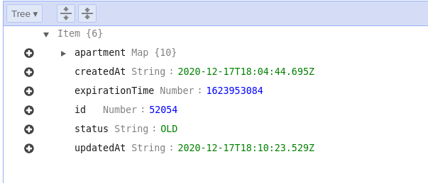

**Коллекция** - `OnlinerApartment`:

`hash_key` и `range_key` образуют **Primary Key**

- `chatId`: String; // идентификатор чата между пользователем и ботом, `hash_key`
- `filterName`: String; // наименования фильтра, `range_key`
- `createdAt`: String; // timestamp создания
- `updatedAt`: String; // timestamp редактирования
- `filter`: Map; // храни объект, реализующий IFilter интерфейс
  - [там оочень больша модель IOnlinerApartment](../src/onliner-crawler/model.ts)

```ts
export interface IFIlter {
  filterName: string;
  city?: string;
  currency?: Currency;
  minPrice?: number;
  maxPrice?: number;
  roomsNumber?: number;
}

export type Currency = 'USD' | 'BYN';
```

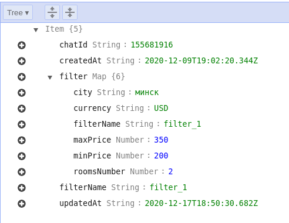

## Onliner-Crawler сервис

> ВОТ ТУТ [serverless.yml config](../src/onliner-crawler/serverless.yml)

> ВОТ ТУТ [entry point (`handler` функция)](../src/onliner-crawler/onliner-crawler.ts)

Onliner-Crawler будет собирать данные с onliner, проверять их и отправлять новые данные в DynamoDB для следующей обработки.

запускается кажде 15 минут, описано в [serverless.yml config](../src/onliner-crawler/serverless.yml)

> а именно здечь

```yml
# ...
events:
  - schedule:
      name: onliner-crawler-event
      description: 'Run the Onliner Crawler to fetch data from Onliner'
      rate: rate(15 minutes)
# ...
```

**Обощенный алгоритм:**

1. Совершает первоначальный запрос на `Onliner API`, получает количество элементов, информацтю для пагинации
2. формируется массив запросов к `Onliner API` с параетрами пагинации
3. формируется паралелльное выполнение запросов к `Onliner API` batch-ами по 10 штук, и `timeout = 2500ms`, объявленя из ответов запроов складываются в объект `apartmentMap` типа ключ значение, где ключ - это уникальный идентификатор объявления с `Onliner API`, а значение - само объявлеие
4. Для оптимизации уменьшения количества запросов в БД, мы начинаем выполнять `SCAN` объявлений из нашей коллекции `OnlinerApartment`, и удаляем удаляем объявления из `apartmentMap`,которые пришли из нашей коллекции
   > (тк приходилось бы для каждого элемента совершать операцию `PutItem` с условием выполнения запроса, что безусловно занимает большее количество обращений в БД, чем обычный scan и сделать обработку данных с помощью `Lambda` функци
5. Конечный сформированный/обработанный объект `apartmentMap`, мы начианем перебирать по ключу и заносить данные в нашу коллекцию `OnlinerApartment` со `status: "NEW`

> **Ниже приведу пару monitoring графиков этой Lambda функции**

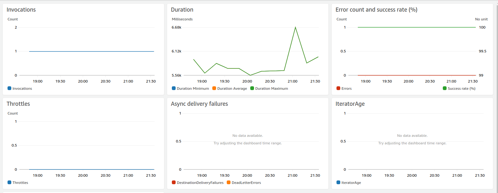

> ниже приведено логирование выполнения `Onliner-Crawler` Lambda функции c помощью сервиса `AWS CloudWatch`

```log
2020-12-20T10:19:36.758+03:00 START RequestId: bfc102c1-2368-4cdb-8fbb-fcf513aaa402 Version: $LATEST
2020-12-20T10:19:36.773+03:00 [info] Onliner Crawler
2020-12-20T10:19:36.775+03:00 [info] Formed Onliner URL: https://ak.api.onliner.by/search/apartments?page=1&limit=500
2020-12-20T10:19:38.336+03:00 [info] PAGE: 1, LIMIT: 500, URL: https://ak.api.onliner.by/search/apartments?page=1&limit=500
2020-12-20T10:19:38.337+03:00 [info] PAGE: 2, LIMIT: 500, URL: https://ak.api.onliner.by/search/apartments?page=2&limit=500
2020-12-20T10:19:38.337+03:00 [info] PAGE: 3, LIMIT: 500, URL: https://ak.api.onliner.by/search/apartments?page=3&limit=500
2020-12-20T10:19:38.337+03:00 [info] PAGE: 4, LIMIT: 500, URL: https://ak.api.onliner.by/search/apartments?page=4&limit=500
2020-12-20T10:19:38.337+03:00 [info] PAGE: 5, LIMIT: 500, URL: https://ak.api.onliner.by/search/apartments?page=5&limit=500
2020-12-20T10:19:38.337+03:00 [info] PAGE: 6, LIMIT: 500, URL: https://ak.api.onliner.by/search/apartments?page=6&limit=500
2020-12-20T10:19:38.337+03:00 [info] PAGE: 7, LIMIT: 500, URL: https://ak.api.onliner.by/search/apartments?page=7&limit=500
2020-12-20T10:19:38.337+03:00 [info] PAGE: 8, LIMIT: 500, URL: https://ak.api.onliner.by/search/apartments?page=8&limit=500
2020-12-20T10:19:38.337+03:00 [info] PAGE: 9, LIMIT: 500, URL: https://ak.api.onliner.by/search/apartments?page=9&limit=500
2020-12-20T10:19:38.338+03:00 [info] Fetch from url: https://ak.api.onliner.by/search/apartments?page=1&limit=500
2020-12-20T10:19:38.339+03:00 [info] Fetch from url: https://ak.api.onliner.by/search/apartments?page=2&limit=500
2020-12-20T10:19:38.340+03:00 [info] Fetch from url: https://ak.api.onliner.by/search/apartments?page=3&limit=500
2020-12-20T10:19:38.353+03:00 [info] Fetch from url: https://ak.api.onliner.by/search/apartments?page=4&limit=500
2020-12-20T10:19:38.354+03:00 [info] Fetch from url: https://ak.api.onliner.by/search/apartments?page=5&limit=500
2020-12-20T10:19:38.355+03:00 [info] Fetch from url: https://ak.api.onliner.by/search/apartments?page=6&limit=500
2020-12-20T10:19:38.373+03:00 [info] Fetch from url: https://ak.api.onliner.by/search/apartments?page=7&limit=500
2020-12-20T10:19:38.374+03:00 [info] Fetch from url: https://ak.api.onliner.by/search/apartments?page=8&limit=500
2020-12-20T10:19:38.375+03:00 [info] Fetch from url: https://ak.api.onliner.by/search/apartments?page=9&limit=500
2020-12-20T10:19:39.195+03:00 [info] Keys in dataMap: 0
2020-12-20T10:19:39.195+03:00 [info] Keys in batchOfData: 500
2020-12-20T10:19:39.355+03:00 [info] Keys in dataMap: 500
2020-12-20T10:19:39.356+03:00 [info] Keys in batchOfData: 500
2020-12-20T10:19:39.375+03:00 [info] Keys in dataMap: 1000
2020-12-20T10:19:39.375+03:00 [info] Keys in batchOfData: 500
2020-12-20T10:19:39.399+03:00 [info] Keys in dataMap: 1500
2020-12-20T10:19:39.399+03:00 [info] Keys in batchOfData: 500
2020-12-20T10:19:39.575+03:00 [info] Keys in dataMap: 2000
2020-12-20T10:19:39.575+03:00 [info] Keys in batchOfData: 500
2020-12-20T10:19:39.624+03:00 [info] Keys in dataMap: 2500
2020-12-20T10:19:39.633+03:00 [info] Keys in batchOfData: 500
2020-12-20T10:19:39.659+03:00 [info] Keys in dataMap: 3000
2020-12-20T10:19:39.673+03:00 [info] Keys in batchOfData: 500
2020-12-20T10:19:39.728+03:00 [info] Keys in dataMap: 3500
2020-12-20T10:19:39.733+03:00 [info] Keys in batchOfData: 426
2020-12-20T10:19:39.855+03:00 [info] Keys in dataMap: 3926
2020-12-20T10:19:39.873+03:00 [info] Keys in batchOfData: 500
2020-12-20T10:19:39.874+03:00 [info] fetching from Onliner: length: 4426
2020-12-20T10:19:39.874+03:00 [info] filterOutOnlyNewValues
2020-12-20T10:19:39.874+03:00 [info] Scan: Limit = 500
2020-12-20T10:19:40.337+03:00 [info] LastEvaluatedKey: {"id":430131}
2020-12-20T10:19:40.596+03:00 [info] LastEvaluatedKey: {"id":387010}
2020-12-20T10:19:40.975+03:00 [info] LastEvaluatedKey: {"id":623763}
2020-12-20T10:19:41.155+03:00 [info] LastEvaluatedKey: {"id":626663}
2020-12-20T10:19:41.418+03:00 [info] LastEvaluatedKey: {"id":625270}
2020-12-20T10:19:41.634+03:00 [info] LastEvaluatedKey: {"id":238964}
2020-12-20T10:19:41.774+03:00 [info] LastEvaluatedKey: {"id":624113}
2020-12-20T10:19:41.937+03:00 [info] LastEvaluatedKey: {"id":624492}
2020-12-20T10:19:42.134+03:00 [info] LastEvaluatedKey: {"id":556877}
2020-12-20T10:19:42.336+03:00 [info] LastEvaluatedKey: {"id":612366}
2020-12-20T10:19:42.456+03:00 [info] LastEvaluatedKey: {"id":585886}
2020-12-20T10:19:42.517+03:00 [info] LastEvaluatedKey: undefined
2020-12-20T10:19:42.517+03:00 [info] Total raws: 5683
2020-12-20T10:19:42.517+03:00 [info] filtered apartments from Onliner: length: 3
2020-12-20T10:19:42.517+03:00 [info] new apartment id: 627332
2020-12-20T10:19:42.534+03:00 [info] new apartment id: 627331
2020-12-20T10:19:42.534+03:00 [info] new apartment id: 627330
2020-12-20T10:19:42.593+03:00 [info] COMPLETE SUCCESS, put items: 3
2020-12-20T10:19:42.595+03:00 END RequestId: bfc102c1-2368-4cdb-8fbb-fcf513aaa402
2020-12-20T10:19:42.595+03:00 REPORT RequestId: bfc102c1-2368-4cdb-8fbb-fcf513aaa402
2020-12-20T10:19:42.595+03:00 Duration: 5836.21 ms Billed Duration: 5837 ms	Memory Size: 512 MB
2020-12-20T10:19:42.595+03:00 Max Memory Used: 140 MB Init Duration: 550.60 ms
```

## AppSync Public (GraphQL Endpoint), имя сервиса: `taphut-api-public`

> ВОТ ТУТ [public graphql schema config](../src/appsync/public/schema.graphql)

> ВОТ ТУТ [serverless.yml config file](../src/appsync/public/serverless.yml)

> ВОТ ТУТ [request.vtl](../src/appsync/public/apartments/onliner/request.vtl)

> ВОТ ТУТ [response.vtl](../src/appsync/public/apartments/onliner/response.vtl)

> **!! ВОТ ТУТ ВАЖНО БУДЕТ УПОМЯНУТЬ ПРО ТОТ САМЫЙ VTL, его реализацию**

### схема GraphQL

```graphql
schema {
  query: Query
}

type Query {
  # get onliner apartments
  onlinerApartments(limit: Int = 10, nextToken: String = null): OnlinerApartmentRowWithPagination
}

#  ...
```

### объявление GraphQL в AppSync

```yml
# ...
mappingTemplatesLocation: .
mappingTemplates:
  - dataSource: OnlinerApartment
    type: Query
    field: onlinerApartments
    request: apartments/onliner/request.vtl
    response: apartments/onliner/response.vtl
# ...
```

### request.vtl для `onlinerApartments`

```vtl
{
  "version" : "2017-02-28",
  "operation" : "Scan",
  "limit": $util.defaultIfNull($ctx.args.limit, 10),
  "nextToken": $util.toJson($util.defaultIfNull($ctx.args.nextToken, null)),
}
```

### response.vtl для `onlinerApartments`

```vtl
$util.toJson($context.result)
```

### объявление ресурса

```yml
# ...
dataSources:
  - type: AMAZON_DYNAMODB
    name: OnlinerApartment
    description: 'Onliner apartment table'
    config:
      tableName: 'OnlinerApartment'
      serviceRoleArn: '${self:custom.appSyncDynamoServiceRole}'
# ...
```

> **Ниже приведу пару monitoring графиков этого сервиса**

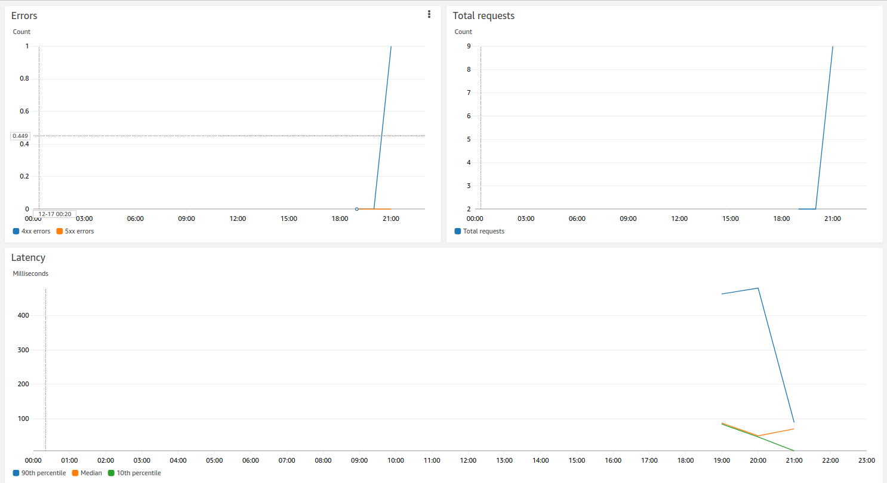

## **Разработка telegram-bot (service: telegram-bot) :**

> ВОТ ТУТ [serverless.yml config file](../src/telegram-bot/serverless.yml)

> ВОТ ТУТ [entry point (`handler` функция)](../src/telegram-bot/webhook.ts)

> **NOTE:** Важно отметить, что я выбрал реализацию Telegram-bot именно через webhook, так long polling запросы требуют открытого соединения, что не целесообразно для AWS Lambda. Так как мы плати за время выполнения функции и вообще максимально допустимое время выполнения функции состовялет не более 15 минут

> настройка функции на event от APIGateway, POST запрос на ${domain}/bot-api, CORS enabled

```yml
# ...
functions:
  webhook:
    handler: webhook.handler
    description: Taphut telegram-bot webhook
    memorySize: 256
    timeout: 30
    events:
      - http:
          path: bot-api
          method: post
          cors: true
# ...
```

Для реализации интерфейса взаимодействия пользователя с приложеним, я выбрал вариант разработки CLI интерфейса, и потом посредством его парсить входящие данные из бота, и возращать результат.

Для реализации CLI интерфейса взаимодейсвтяи был выбран паке [yargs](https://github.com/yargs/yargs).

[yargs](https://github.com/yargs/yargs) - помогает создавать интерактивные инструменты командной строки, анализируя аргументы и создавая элегантный пользовательский интерфейс.

> ВОТ ТУТ [главный файл, в котором я предостовляю builder CLI parser-a `export function buildParser`](../src/telegram-bot/cli.ts)

> ВОТ ТУТ [файл, в котором я задаю правила комманды `filter-list`](../src/telegram-bot/commands/filter-list.ts)

> ВОТ ТУТ [файл, в котором я задаю правила комманды `filter-get`](../src/telegram-bot/commands/filter-get.ts)

> ВОТ ТУТ [файл, в котором я задаю правила комманды `filter-create`](../src/telegram-bot/commands/filter-create.ts)

> ВОТ ТУТ [файл, в котором я задаю правила комманды `filter-update`](../src/telegram-bot/commands/filter-update.ts)

> ВОТ ТУТ [файл, в котором я задаю правила комманды `filter-delete`](../src/telegram-bot/commands/filter-delete.ts)

[yargs](https://github.com/yargs/yargs) пакет автоматически потом дополнит такие комманды как `help`, основываясь на моих коммандах: `filter-list`, `filter-get`, `filter-create`, `filter-update`, `filter-delete`

Так же, я переопределил метод ответа CLI парсера, вместо логгированя в консоль, конечный ответ вызовет функцию, которая отправит запрос на Telegram-API и пользователь получит ответ.

```ts
// ...

function buildResponder(token: string, chat_id: string): any {
  return function (msg: any): any {
    sendToUser({ token, chat_id, text: msg });
    console.log(msg);
  };
}

// ...
export function buildParser({ token, chatId }: buildParserParams): (stringCommand: string) => void {
  // ...

  const context: Context = {
    respond: buildResponder(token, chatId),
  };

  return (stringCommand: string) => {
    logger.info(`Command to parse: ${stringCommand}`);
    parser.parse(stringCommand || '', context, (err: any, argv: any, output: any) => {
      if (err) console.log(err.message);
      if (output) {
        argv.respond(output);
      }
    });
  };
}
// ...
```

Далее, мы обратилсь в `@BotFather` для создания телеграмм-бота, установили полученый токен в **AWS System Manager -> Parameter Store**. И сконфигурировали webhook нашего бота на endpoint APIGateway, который передаст обработку запроса уже в нашу Lambda функцию

> **Ниже приведу пару monitoring графиков этой Lambda функции**

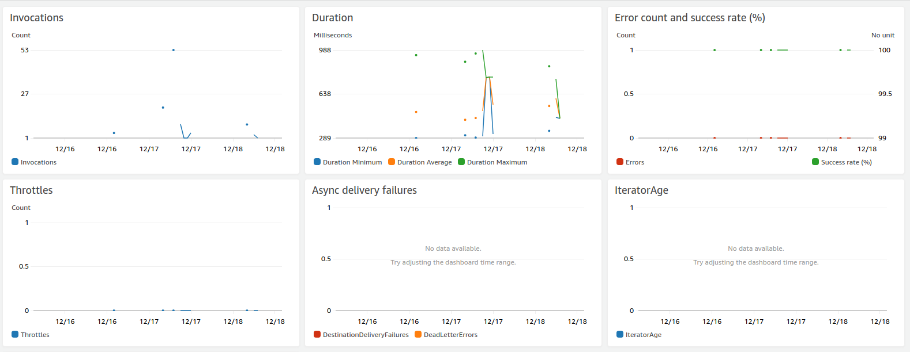

## **Разработка telegram-notifier (service: telegram-notifier) :**

> ВОТ ТУТ [serverless.yml config file](../src/telegram-notifier/serverless.yml)

> ВОТ ТУТ [entry point (`handler` функция)](../src/telegram-notifier/telegram-notifier.ts)

**Обощенный алгоритм:**

1. Scan все объявления из `DynamoDB` коллекции `OnlinerApartment` со статусом `NEW`
2. Scan все фильтры из `DynamoDB` коллекции `TelegramUserFilters`
3. для каждого объявления проверяем фильтр

   - инициализируем пустой массив `notifications`
   - инициализириуем и формируем объект `filterMapObj` типа `{ [key: chatId]: arrayOfChatFilters[] }`
   - проходим по массиву `notifications`
     - проходим по ключам объекта `filterMapObj` и достаем массивы фильтров в `chatFilters`
       - проходим по массиву фильтров `chatFilters`
       - если объявление подходит под фильтр, то заносим идентификатор чата и объявление в массив `notifications` и переходим к следующему ключу объектав `filterMapObj`

4. Запускаем параллельную обработку запросов массива `notifications`, отсылаем пользователю объявление с помощью `sendToUser(filter.chatID, convertApartmentToMsg(apartment))`
5. Изменяем статус всех объявлений с `NEW` на `OLD`

> ниже приведена часть кода из [serverless.yml config file](../src/telegram-notifier/serverless.yml), в котором настраивается `schedule` событие, которое будет запускать данную функцию каждые 15 минут

```yml
functions:
  telegram-notifier:
    handler: telegram-notifier.handler
    description: Taphut telegram-bot webhook
    memorySize: 256
    timeout: 300
    events:
      - schedule:
          name: telegram-notifier-event
          description: 'Scan all users filters and search for suitable new appartment'
          rate: rate(15 minutes)
```

> ниже приведено логирование выполнения `telegram-notifier` Lambda функции c помощью сервиса `AWS CloudWatch`

```log
2020-12-21T12:25:08.573+03:00	START RequestId: 555982da-0494-4620-a227-bc1bb124f74c Version: $LATEST
2020-12-21T12:25:08.611+03:00	[info] Telegram-notifier start
2020-12-21T12:25:08.633+03:00	[info] filterOutOnlyNewValues
2020-12-21T12:25:08.671+03:00	[info] Scan: Limit = undefined
2020-12-21T12:25:09.030+03:00	[info] LastEvaluatedKey: {"id":627016}
2020-12-21T12:25:09.085+03:00	[info] LastEvaluatedKey: {"id":577312}
2020-12-21T12:25:09.146+03:00	[info] LastEvaluatedKey: {"id":626387}
2020-12-21T12:25:09.170+03:00	[info] LastEvaluatedKey: undefined
2020-12-21T12:25:09.171+03:00	[info] Total raws: 1
2020-12-21T12:25:09.171+03:00	[info] newApartments count: 1
2020-12-21T12:25:09.194+03:00	[info] filters count: 12
2020-12-21T12:25:09.212+03:00	[info] Total notifications count: 0
2020-12-21T12:25:09.231+03:00	[info] keys for updated to OLD: [{"id":627342}]
2020-12-21T12:25:09.252+03:00	[info] Apartments status is updated to OLD
2020-12-21T12:25:09.252+03:00	[info] Telegram-notifier complete
2020-12-21T12:25:09.271+03:00	END RequestId: 555982da-0494-4620-a227-bc1bb124f74c
2020-12-21T12:25:09.271+03:00	REPORT RequestId: 555982da-0494-4620-a227-bc1bb124f74c
2020-12-21T12:25:09.271+03:00 Duration: 698.46 ms	Billed Duration: 699 ms	Memory Size: 256 MB
2020-12-21T12:25:09.271+03:00 Max Memory Used: 95 MB Init Duration: 569.51 ms
```

> **Ниже приведу пару monitoring графиков этой Lambda функции**

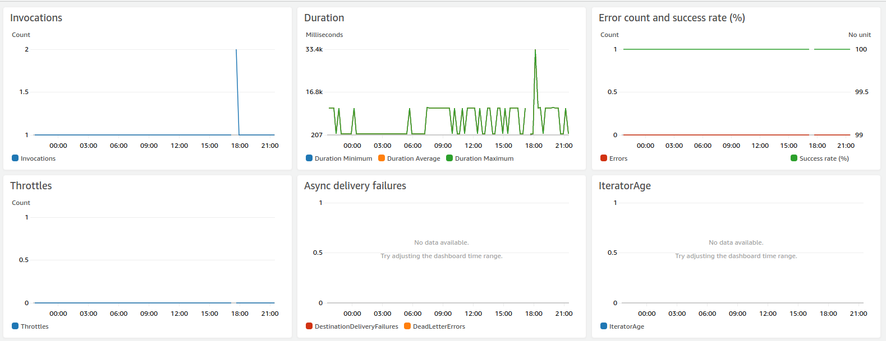

## **3.5 описание разработки Angular client-а + настройка его CI/DI?**

Для frontend-a создан отдельный репозиторий на [Github](https://github.com/Fomin2402/taphut-front).

Первым делом, была продумана архитектура DOM-a Angular приложения:

```sh
root
├── auth/signin
├── auth/signup
├── auth/signup/confirm
├── auth/password/forger
├── auth/password/forger/confirm
├── auth/password/change
└── main (canActivate: AuthenticationGuard)
   ├── Telegram OAuth
   └── property rental ads


```

Первым делом, надо было реализовать Аутентификацию/Авторизацию. Для этого нам понадобиться [Amplify библиоетка](https://docs.amplify.aws/), для обращения к нашем AWS Cognito сервису. Тут мы столкнулись с неудобством использования этой библиотеки, тк в Angular-е очень удобно использовать реактивный подход с помощью `Rxjs`. Поэтому была написан первый варант обертки над Amplify для удобного взаимодействия. ([ссылка тут](https://github.com/Fomin2402/taphut-front/blob/master/src/app/services/amplify.service.ts)).

После этого, следующим шагом была реализация `AuthenticationGuard`, для защиты перехода не аутентифицированного юезра на страницы приложения ([ссылка на AuthenticationGuard](https://github.com/Fomin2402/taphut-front/blob/master/src/app/guards/authentication.guard.ts)). Его мы будем использовать в определении `Rouets` [тут](https://github.com/Fomin2402/taphut-front/blob/master/src/app/app-routing.module.ts). Сделан таким образом, что если неаутентифицированный пользователь захочет перейти на закрытую страницу, то он будем перенаправлен на страницу `login-a`.

Следующим шагом было подключение UI библиотеки [Angular Material](https://material.angular.io/). Его преимущества:

- Интернационализированные и доступные компоненты для всех. Хорошо протестирован, чтобы гарантировать производительность и надежность.
- Простые API с последовательным кроссплатформенным поведением.
- Универсальный. Предоставьте инструменты, которые помогут разработчикам создавать собственные настраиваемые компоненты с общими шаблонами взаимодействия.
- Настраивается в рамках спецификации Material Design.
- Создан командой Angular для интеграции с Angular имея высокую производительность/эффективность.

После того, как мы подключили [Angular Material](https://material.angular.io/), первым делом в `root` компоненте реализовал `header`:

```html
<mat-toolbar color="primary" class="example-toolbar">
  <h1 class="header-title big">Taphut</h1>
  <span class="flex-1"></span>

  <button *ngIf="amplify.isAuthenticatedSubj | async" mat-button (click)="logout()">logout</button>
  <a
    *ngIf="amplify.isAuthenticatedSubj | async"
    mat-button
    [routerLink]="['/', 'auth', 'password', 'change']"
    >password change</a
  >
  <a
    *ngIf="!(amplify.isAuthenticatedSubj | async)"
    mat-button
    [routerLink]="['/', 'auth', 'signin']"
    >signin</a
  >
  <a
    *ngIf="!(amplify.isAuthenticatedSubj | async)"
    mat-button
    [routerLink]="['/', 'auth', 'signup']"
    >signup</a
  >
</mat-toolbar>

<router-outlet></router-outlet>
```

Далее надо было реазиловать `GraphQL` севрис, который позволит нам взаимодействовать с нашем бэком посредством `GraphQL API`. Первым делом, решил реализовать на главной странице показ объявления по аренде недвижимости с `infinite-scroll` пагинецией.

> [код на GraphQL сервис](https://github.com/Fomin2402/taphut-front/blob/master/src/app/graphql.module.ts)

> [код на сервис, который будет предоставлять API для получения объявлений](https://github.com/Fomin2402/taphut-front/blob/master/src/app/services/product.service.ts)

> [код на компонент, который будет обращауется к сервису за объявлениями, а потом их выводит](https://github.com/Fomin2402/taphut-front/blob/master/src/app/components/shell/shell.component.ts)

Следующим шагом стало добавления [Telegram Login Widget](https://core.telegram.org/widgets/login), чтобы в будущем позволить web-клиенту привязать к своей учетной записи чат с ботом из телеграмма. Это нужно, чтобы в будущем добавить функционал, для более удобного редактирования фильтров, просмотра объявлений и статистики с помощью браузерного клиента, при этом получая нотификации в `Telegram` клиенте.

Первая сложность в реализации [Telegram Login Widget](https://core.telegram.org/widgets/login) стало то, что в Angular нельзя просто так вставить в разметку тег `<script>`.
Я создал компонент, который эо обходит, добавляя динамически в разметку необходимый `<script>`. [Ссылка на `telegram component`](https://github.com/Fomin2402/taphut-front/blob/master/src/app/components/telegram/telegram.component.ts).

> тут важно упомянуть, что динамическая вставка в DOM должна происходить именно в `AfterViewInit` **lifecycle hook-e**.

Далее, для корректной работы [Telegram Login Widget](https://core.telegram.org/widgets/login) необходимо запустить приложение на `https`. На этом этапе я решил подключить CI/DI для более удобной работы/тестирования моего Angular приложения.

В качестве CI/DI инструмента я выбрал облачного провайдера [Vercel](https://vercel.com).

[Vercel](https://vercel.com) - это облачная платформа для статических сайтов и бессерверных функций, которая идеально подходит для вашего рабочего процесса. Он позволяет разработчикам размещать веб-сайты и веб-службы Jamstack, которые мгновенно развертываются, автоматически масштабируются и не требуют контроля, и все это без настройки.

> **Jamstack** - это новая стандартная архитектура для Интернета. Используя рабочие процессы Git и современные инструменты сборки, предварительно обработанный контент передается в CDN и становится динамическим с помощью API и бессерверных функций. Технологии в стеке включают фреймворки JavaScript, генераторы статических сайтов, безголовые CMS и CDN.

> **Ниже приведу пример ng version**

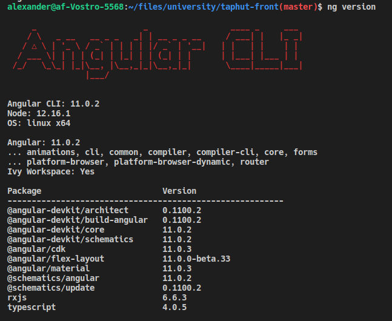

> **Ниже приведу пример Vercel dashboard**

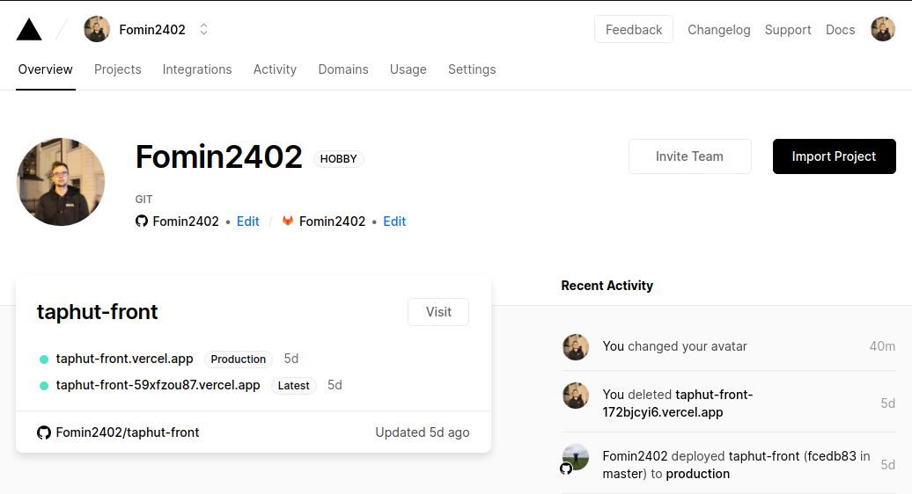

> **Ниже приведу пример деплоя master ветки**

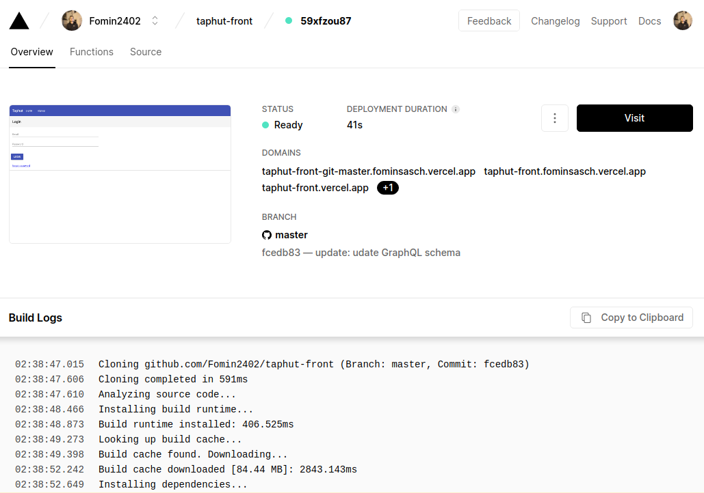

> **Ниже приведу пример деплоя ветки, когда произошла ошибка сборки**

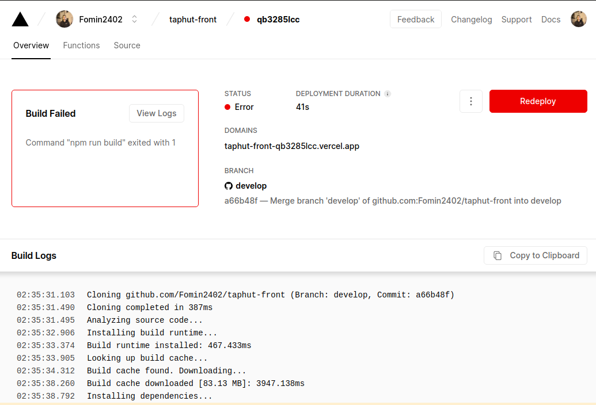

> **Ниже приведу пример настройки domain-a**

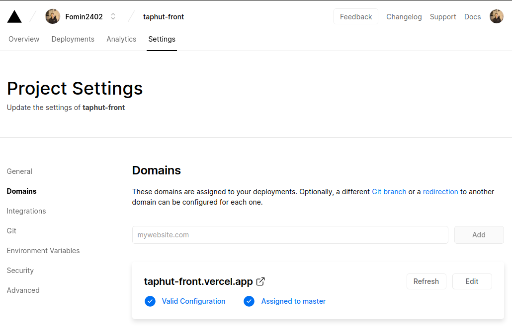

Ниже приведена структура angular проекта:

```sh
~/taphut-front
├── README.md
├── angular.json
├── e2e
|  ├── protractor.conf.js
|  ├── src
|  |  ├── app.e2e-spec.ts
|  |  └── app.po.ts
|  └── tsconfig.json
├── karma.conf.js
├── package-lock.json
├── package.json
├── src
|  ├── app
|  |  ├── app-routing.module.ts
|  |  ├── app.component.html
|  |  ├── app.component.scss
|  |  ├── app.component.spec.ts
|  |  ├── app.component.ts
|  |  ├── app.module.ts
|  |  ├── components
|  |  |  ├── change-password
|  |  |  ├── confirm-signup
|  |  |  ├── forgot-password
|  |  |  ├── forgot-password-submit
|  |  |  ├── shell
|  |  |  ├── signin
|  |  |  ├── signup
|  |  |  └── telegram
|  |  ├── graphql.module.ts
|  |  ├── guards
|  |  |  └── authentication.guard.ts
|  |  ├── services
|  |  |  ├── amplify.service.spec.ts
|  |  |  ├── amplify.service.ts
|  |  |  ├── product.service.spec.ts
|  |  |  └── product.service.ts
|  |  └── utils
|  |     ├── form-validators.ts
|  |     ├── models.ts
|  |     └── routes.ts
|  ├── assets
|  ├── environments
|  |  ├── environment.prod.ts
|  |  └── environment.ts
|  ├── favicon.ico
|  ├── index.html
|  ├── main.ts
|  ├── polyfills.ts
|  ├── styles.scss
|  └── test.ts
├── tsconfig.app.json
├── tsconfig.json
├── tsconfig.spec.json
└── tslint.json
```

# **Тестирование**

## описание тестирования

# **Руководство программиста**

## описание руководства программиста

# Ссылки

1. [Onliner.by](Onliner.by)
2. [Realt.by](https://realt.by/)
3. [Domovita.by](https://domovita.by/)
4. [TypeScript](https://www.typescriptlang.org/docs/handbook/utility-types.html)
5. [ESLint](https://eslint.org/docs/user-guide/configuring)
6. [TSLint](https://palantir.github.io/tslint/)
7. [Prettier](https://prettier.io/docs/en/options.html)
8. [Webpack](https://webpack.js.org/)
9. [Yarn](https://classic.yarnpkg.com/en/docs/)
10. [Serverless](https://www.serverless.com/)
11. [Terraform](https://www.terraform.io/)
12. [Vercel](https://vercel.com/docs)
13. [AWS-Vault](https://github.com/99designs/aws-vault)
14. [Github](https://github.com/)
15. [AWS Cognito](https://docs.aws.amazon.com/cognito/)
16. [AWS S3](https://docs.aws.amazon.com/s3/index.html)
17. [AWS DynamoDB](https://docs.aws.amazon.com/dynamodb/index.html)
18. [AWS Lambda](https://docs.aws.amazon.com/lambda/index.html)
19. [AWS AppSync](https://docs.aws.amazon.com/appsync/latest/devguide/welcome.html)
20. [AWS VTL](https://docs.aws.amazon.com/appsync/latest/devguide/resolver-context-reference.html)
21. [AWS APIGateway](https://docs.aws.amazon.com/apigateway/index.html)
22. [AWS CloudFormation](https://docs.aws.amazon.com/cloudformation/)
23. [AWS System Manager](https://docs.aws.amazon.com/systems-manager/index.html)
24. [AWS KMS](https://aws.amazon.com/kms/)
25. [AWS CloudWatch](https://docs.aws.amazon.com/cloudwatch/index.html)
26. [AWS Amplify](https://docs.amplify.aws/)
27. [AWS SNS](https://docs.aws.amazon.com/sns/index.html)
28. [Angular](https://angular.io/)
29. [Telegam API](https://core.telegram.org/)
30. [AWS Vault](https://github.com/99designs/aws-vault)
